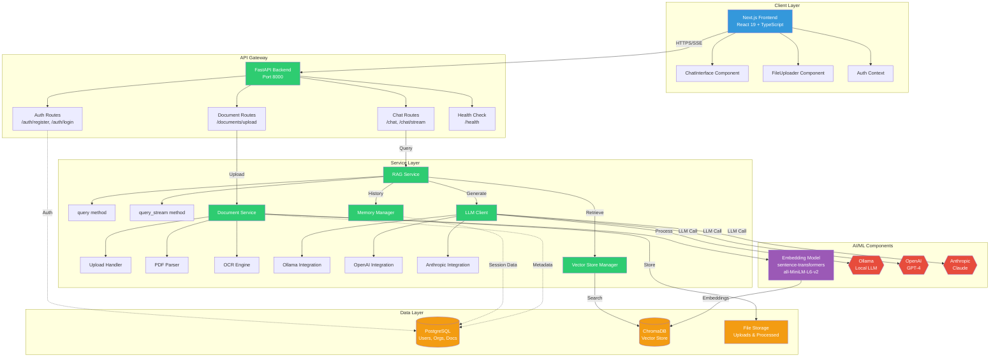
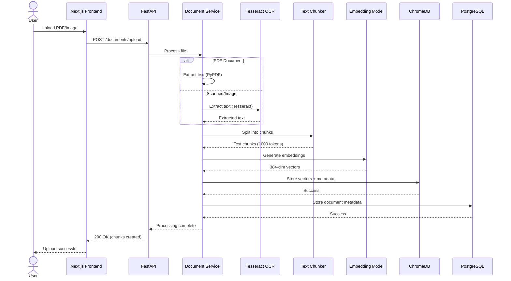
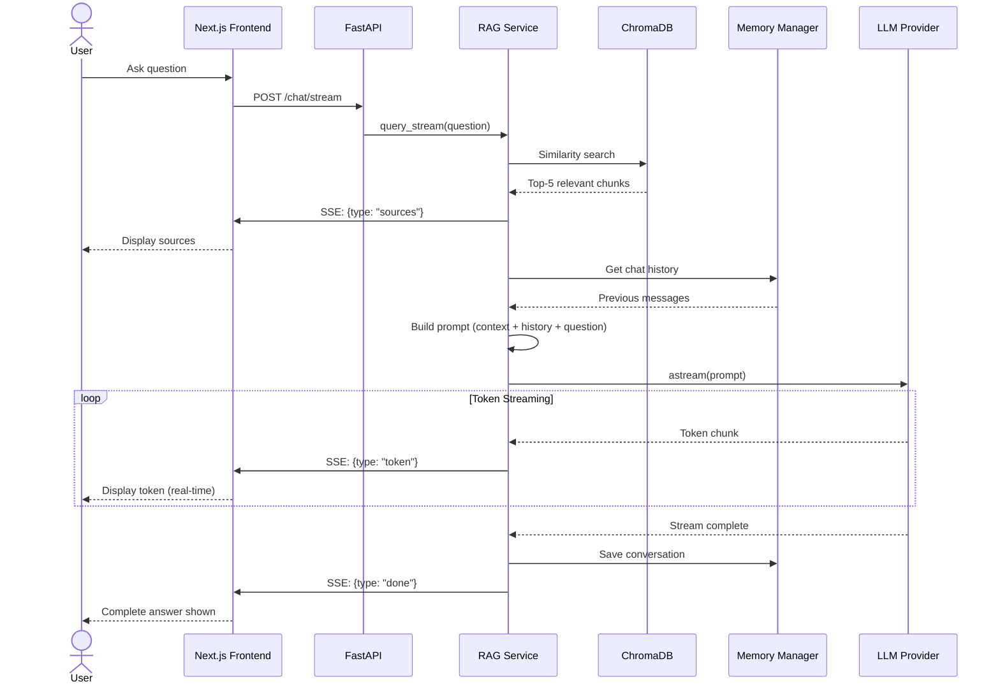
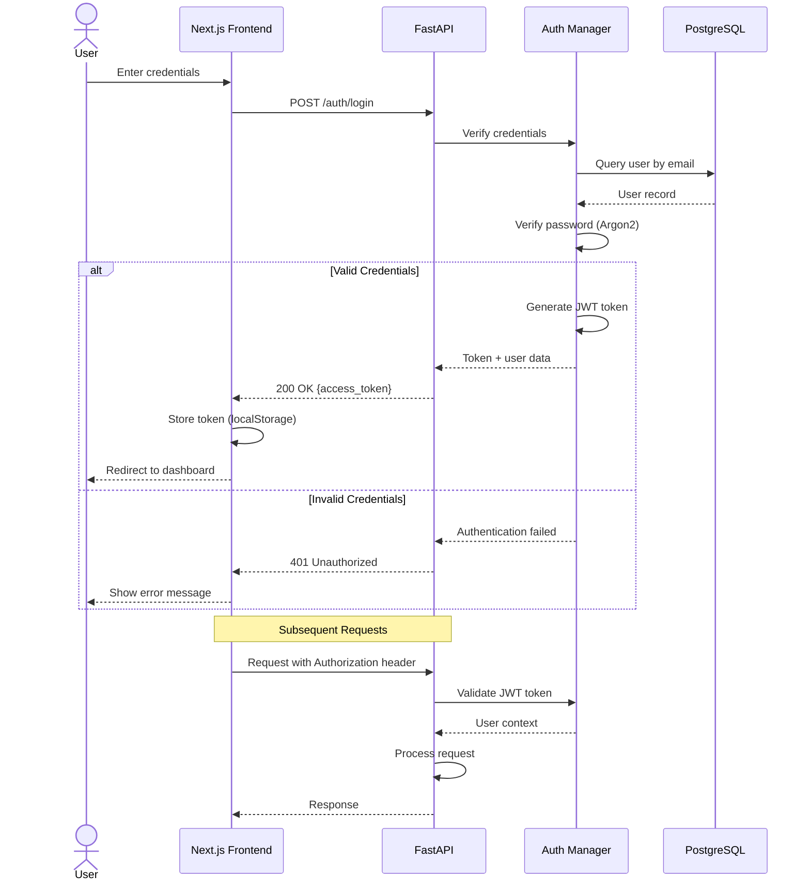
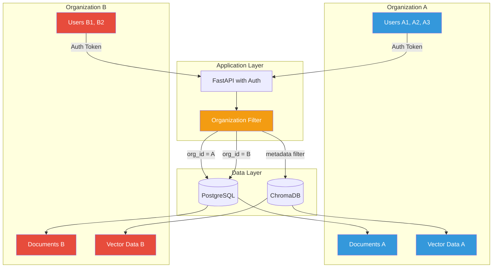

# Architecture Generation Prompts for Adamani AI RAG

This document contains prompts and code for generating various architecture diagrams for the Adamani AI RAG system.

---

## 🎨 AI Image Generator Prompt (For ChatGPT, Midjourney, DALL-E)

Use this prompt with AI image generators to create visual architecture diagrams:

```
Create a professional, detailed system architecture diagram for an enterprise AI RAG (Retrieval-Augmented Generation) application with the following specifications:

STYLE:
- Clean, modern technical diagram
- Use rectangular boxes for services/components
- Use cylindrical shapes for databases
- Use cloud shapes for external APIs
- Color coding: Blue for frontend, Green for backend services, Orange for databases, Purple for AI/ML components
- Include arrows showing data flow with labels
- Professional font, high contrast, white background

LAYERS (Top to Bottom):

1. CLIENT LAYER:
   - Next.js Frontend (React 19, TypeScript, Tailwind CSS)
   - Components: ChatInterface, FileUploader, AuthContext
   - Technologies: SSE Client, Fetch API

2. API GATEWAY LAYER:
   - FastAPI Backend (Port 8000)
   - Routes: /auth, /chat, /chat/stream, /documents, /health
   - Features: JWT Auth, CORS, Background Tasks

3. SERVICE LAYER:
   - RAG Service (Query & Stream methods)
   - Document Service (Upload & Processing)
   - LLM Client (Multi-provider: Ollama, OpenAI, Anthropic)
   - Memory Manager (Conversation history)
   - Vector Store Manager (Embeddings & Search)

4. AI/ML LAYER:
   - LLM Providers (shown as external clouds):
     * Ollama (Local)
     * OpenAI GPT-4
     * Anthropic Claude
   - Embedding Model: Sentence-Transformers (all-MiniLM-L6-v2)

5. DATA LAYER:
   - PostgreSQL Database (Users, Organizations, Documents metadata)
   - ChromaDB Vector Store (Document embeddings)
   - File Storage (Uploads, Processed files)

DATA FLOWS:
1. Document Upload: Client → API → Document Service → OCR/PDF Parser → Chunking → Embeddings → ChromaDB
2. Query Flow: Client → API → RAG Service → Vector Search → LLM → Stream Response → Client
3. Auth Flow: Client → API → PostgreSQL → JWT Token → Client

KEY FEATURES TO HIGHLIGHT:
- Real-time streaming (SSE)
- Multi-tenant architecture
- OCR processing (Tesseract)
- Vector similarity search
- JWT authentication
- Async processing

Add labels for: "Production-Grade RAG System", "Real-Time Streaming", "Multi-Tenant", "Enterprise Authentication"
```

---

## 📐 Mermaid Diagram Code

### System Architecture Diagram



### Data Flow: Document Upload



### Data Flow: Query with Streaming



### Authentication Flow



### Multi-Tenant Architecture



---

## 🔧 Component Breakdown for Manual Diagramming

Use this structured breakdown for tools like draw.io, Lucidchart, or Visio:

### Layer 1: Client Layer (Blue)
```
┌─────────────────────────────────────────┐
│      Next.js Frontend (Port 3000)       │
│  ┌──────────────────────────────────┐   │
│  │  React Components:               │   │
│  │  • ChatInterface.tsx             │   │
│  │  • FileUploader.tsx              │   │
│  │  • ProtectedRoute.tsx            │   │
│  │  • AuthContext.tsx               │   │
│  └──────────────────────────────────┘   │
│  ┌──────────────────────────────────┐   │
│  │  Services:                       │   │
│  │  • api.ts (API client)           │   │
│  │  • sendChatMessageStream()       │   │
│  │  • uploadDocument()              │   │
│  └──────────────────────────────────┘   │
│                                          │
│  Tech: React 19, TypeScript, Tailwind   │
└─────────────────────────────────────────┘
           │
           │ HTTPS + SSE
           ▼
```

### Layer 2: API Gateway (Green)
```
┌─────────────────────────────────────────┐
│      FastAPI Backend (Port 8000)        │
│  ┌──────────────────────────────────┐   │
│  │  Routes:                         │   │
│  │  • /auth (register, login)       │   │
│  │  • /chat (query, stream, status) │   │
│  │  • /documents (upload, clear)    │   │
│  │  • /health                       │   │
│  └──────────────────────────────────┘   │
│  ┌──────────────────────────────────┐   │
│  │  Middleware:                     │   │
│  │  • CORS Configuration            │   │
│  │  • JWT Authentication            │   │
│  │  • Background Tasks              │   │
│  └──────────────────────────────────┘   │
│                                          │
│  Tech: FastAPI 0.115, Uvicorn, Pydantic │
└─────────────────────────────────────────┘
           │
           │ Dependency Injection
           ▼
```

### Layer 3: Service Layer (Green)
```
┌─────────────────────────────────────────┐
│           RAG Service                    │
│  • query(question, session_id, k)       │
│  • query_stream(question, ...)          │
│  • _format_docs(docs)                   │
└─────────────────────────────────────────┘

┌─────────────────────────────────────────┐
│        Document Service                  │
│  • process_document(file, use_ocr)      │
│  • extract_text_from_pdf()              │
│  • extract_text_with_ocr()              │
│  • chunk_text(text)                     │
└─────────────────────────────────────────┘

┌─────────────────────────────────────────┐
│           LLM Client                     │
│  • get_client() -> BaseLanguageModel    │
│  • Providers:                           │
│    - Ollama (local)                     │
│    - OpenAI (GPT-4, GPT-4-mini)         │
│    - Anthropic (Claude 3.5)             │
└─────────────────────────────────────────┘

┌─────────────────────────────────────────┐
│        Memory Manager                    │
│  • get_history(session_id)              │
│  • add_user_message(session, msg)       │
│  • add_ai_message(session, msg)         │
│  • clear_history(session_id)            │
└─────────────────────────────────────────┘

┌─────────────────────────────────────────┐
│      Vector Store Manager                │
│  • add_documents(docs)                  │
│  • similarity_search(query, k)          │
│  • clear()                              │
└─────────────────────────────────────────┘
```

### Layer 4: AI/ML Components (Purple)
```
┌─────────────────────────────────────────┐
│      Embedding Model                     │
│  Model: all-MiniLM-L6-v2                │
│  Dimensions: 384                        │
│  Provider: HuggingFace                  │
└─────────────────────────────────────────┘

┌─────────────────────────────────────────┐
│      LLM Providers (External)            │
│  ┌──────────────────────────────────┐   │
│  │  Ollama (Local)                  │   │
│  │  Models: llama3, mistral         │   │
│  └──────────────────────────────────┘   │
│  ┌──────────────────────────────────┐   │
│  │  OpenAI API                      │   │
│  │  Models: gpt-4, gpt-4o-mini      │   │
│  └──────────────────────────────────┘   │
│  ┌──────────────────────────────────┐   │
│  │  Anthropic API                   │   │
│  │  Models: claude-3-5-sonnet       │   │
│  └──────────────────────────────────┘   │
└─────────────────────────────────────────┘

┌─────────────────────────────────────────┐
│      OCR Engine                          │
│  Engine: Tesseract                      │
│  Languages: eng                         │
│  Support: pdf2image, Pillow             │
└─────────────────────────────────────────┘
```

### Layer 5: Data Layer (Orange)
```
┌─────────────────────────────────────────┐
│      PostgreSQL Database                 │
│  ┌──────────────────────────────────┐   │
│  │  Tables:                         │   │
│  │  • users (id, email, password)   │   │
│  │  • organizations (id, name)      │   │
│  │  • organization_members          │   │
│  │  • documents (id, org_id, file)  │   │
│  └──────────────────────────────────┘   │
│  ORM: SQLAlchemy (async)                │
│  Driver: asyncpg                        │
│  Migrations: Alembic                    │
└─────────────────────────────────────────┘

┌─────────────────────────────────────────┐
│      ChromaDB Vector Store               │
│  • Storage: Persistent                  │
│  • Collections: documents               │
│  • Vectors: 384-dimensional             │
│  • Metadata: filename, page, org_id     │
│  • Index: HNSW                          │
└─────────────────────────────────────────┘

┌─────────────────────────────────────────┐
│      File Storage                        │
│  • ./data/uploads/                      │
│  • ./data/processed/                    │
│  • ./data/vectorstore/                  │
└─────────────────────────────────────────┘
```

---

## 🎯 Technology Stack Diagram

```
Frontend Stack:
├── Next.js 15.1.3
├── React 19.0.0
├── TypeScript 5
├── Tailwind CSS 3.4.1
└── Lucide React 0.469.0

Backend Stack:
├── FastAPI 0.115.0
├── Python 3.10+
├── Uvicorn (ASGI server)
└── Poetry (dependency management)

AI/ML Stack:
├── LangChain 0.3.0
│   ├── langchain-core
│   ├── langchain-community
│   ├── langchain-ollama
│   ├── langchain-openai
│   └── langchain-anthropic
├── Sentence-Transformers 3.3.0
└── ChromaDB 0.5.0

Database Stack:
├── PostgreSQL 14+
├── SQLAlchemy 2.0+ (async)
├── Alembic 1.13.0
└── asyncpg 0.29.0

Authentication:
├── FastAPI-Users 12.0.0
├── Python-JOSE (JWT)
├── Passlib + Argon2
└── Email-validator

Document Processing:
├── PyPDF 5.1.0
├── Pytesseract 0.3.0
├── pdf2image 1.17.0
└── Pillow 11.0.0

Utilities:
├── Loguru 0.7.0
├── Pydantic 2.9.0
├── python-dotenv 1.0.0
└── aiofiles 24.1.0
```

---

## 📊 Deployment Architecture

```
┌────────────────────────────────────────────────────┐
│              Render Cloud Platform                 │
│                                                     │
│  ┌──────────────────────────────────────────────┐ │
│  │  Frontend Service                            │ │
│  │  • Next.js Application                       │ │
│  │  • URL: adamani-ai-rag-frontend.onrender.com│ │
│  │  • Auto-deploy from Git                      │ │
│  └──────────────────────────────────────────────┘ │
│                                                     │
│  ┌──────────────────────────────────────────────┐ │
│  │  Backend Service                             │ │
│  │  • FastAPI Application                       │ │
│  │  • URL: adamani-ai-rag-backend.onrender.com │ │
│  │  • Auto-deploy from Git                      │ │
│  │  • Environment Variables Configured          │ │
│  └──────────────────────────────────────────────┘ │
│                                                     │
│  ┌──────────────────────────────────────────────┐ │
│  │  PostgreSQL Database                         │ │
│  │  • Managed PostgreSQL Instance               │ │
│  │  • Automatic Backups                         │ │
│  │  • SSL Connections                           │ │
│  └──────────────────────────────────────────────┘ │
│                                                     │
└────────────────────────────────────────────────────┘

External Services:
┌──────────────┐  ┌──────────────┐  ┌──────────────┐
│   OpenAI     │  │  Anthropic   │  │   GitHub     │
│   API        │  │   API        │  │  Repository  │
└──────────────┘  └──────────────┘  └──────────────┘
```

---

## 🔄 Request Flow Examples

### Example 1: User Registration
```
1. User fills form → Frontend
2. Frontend → POST /auth/register → Backend
3. Backend → Validate data (Pydantic)
4. Backend → Hash password (Argon2)
5. Backend → Create user in PostgreSQL
6. Backend → Auto-create organization
7. Backend → Add user to organization
8. Backend → Return user object
9. Frontend → Auto-login
10. Frontend → Redirect to dashboard
```

### Example 2: Document Upload with OCR
```
1. User selects PDF → Frontend
2. Frontend → POST /documents/upload?use_ocr=true → Backend
3. Backend → Validate file type
4. Backend → Save to ./data/uploads/
5. Backend → Check if scanned (OCR needed)
6. Backend → pdf2image → Convert pages
7. Backend → Tesseract → Extract text per page
8. Backend → Combine extracted text
9. Backend → RecursiveCharacterTextSplitter → Chunk (1000 tokens, 200 overlap)
10. Backend → Sentence-Transformers → Generate embeddings (384-dim)
11. Backend → ChromaDB → Store vectors + metadata
12. Backend → PostgreSQL → Store document metadata
13. Backend → Return success + chunk count
14. Frontend → Show success notification
```

### Example 3: Streaming Query
```
1. User types question → Frontend
2. Frontend → POST /chat/stream → Backend
3. Backend → RAG Service → query_stream()
4. RAG → ChromaDB → similarity_search(question embedding)
5. ChromaDB → Return top-5 relevant chunks
6. RAG → SSE: {type: "sources"} → Frontend
7. Frontend → Display sources in UI
8. RAG → Memory Manager → get chat history
9. RAG → Build prompt (system + context + history + question)
10. RAG → LLM.astream(prompt) → Start streaming
11. LLM → Token 1 → RAG → SSE: {type: "token", token: "The"}
12. Frontend → Display "The" + cursor
13. LLM → Token 2 → RAG → SSE: {type: "token", token: " answer"}
14. Frontend → Display "The answer" + cursor
15. ... (continue for all tokens)
16. LLM → Complete → RAG → Memory → Save conversation
17. RAG → SSE: {type: "done"} → Frontend
18. Frontend → Finalize message, remove cursor
```

---

## 🎨 Color Scheme for Diagrams

```
Client Layer:     #3498db (Blue)
API Gateway:      #2ecc71 (Green)
Services:         #2ecc71 (Green)
AI/ML:            #9b59b6 (Purple)
External APIs:    #e74c3c (Red)
Databases:        #f39c12 (Orange)
File Storage:     #f39c12 (Orange)
Authentication:   #e67e22 (Dark Orange)
Arrows (Data):    #34495e (Dark Gray)
Arrows (Control): #95a5a6 (Light Gray)
```

---

## 📝 Usage Instructions

### For AI Image Generators:
1. Copy the "AI Image Generator Prompt" section
2. Paste into ChatGPT, Claude, or Midjourney
3. Request: "Generate this as a professional architecture diagram"

### For Mermaid Diagrams:
1. Copy any Mermaid code block
2. Paste into:
   - GitHub Markdown (renders automatically)
   - Mermaid Live Editor (https://mermaid.live)
   - VS Code (with Mermaid extension)
   - Notion, Obsidian, or other Mermaid-compatible tools

### For Manual Diagramming:
1. Use the "Component Breakdown" section
2. Import into draw.io, Lucidchart, or Visio
3. Follow the layer structure and color scheme
4. Add arrows according to data flow examples

---

## 🚀 Diagram Export Formats

### Recommended Formats:
- **Presentations**: PNG (high-res, 300 DPI)
- **Documentation**: SVG (scalable, small file size)
- **Reports**: PDF (professional, print-ready)
- **Web**: WebP (optimized, fast loading)

### Mermaid Export:
```bash
# Install Mermaid CLI
npm install -g @mermaid-js/mermaid-cli

# Generate PNG
mmdc -i diagram.mmd -o diagram.png -b transparent

# Generate SVG
mmdc -i diagram.mmd -o diagram.svg

# Generate PDF
mmdc -i diagram.mmd -o diagram.pdf
```

---

**Last Updated**: December 2024
**Version**: 1.0
**Author**: Adamani AI RAG Project Team
